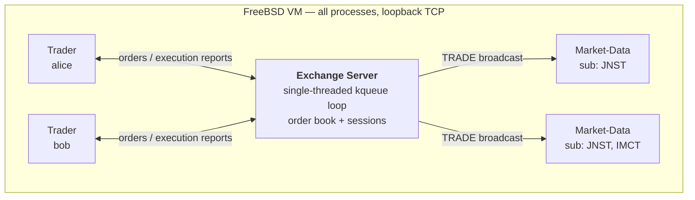
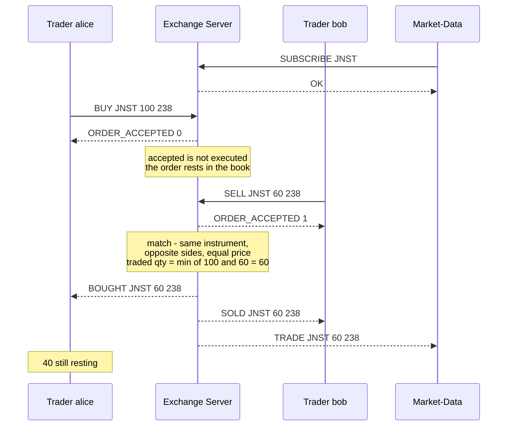
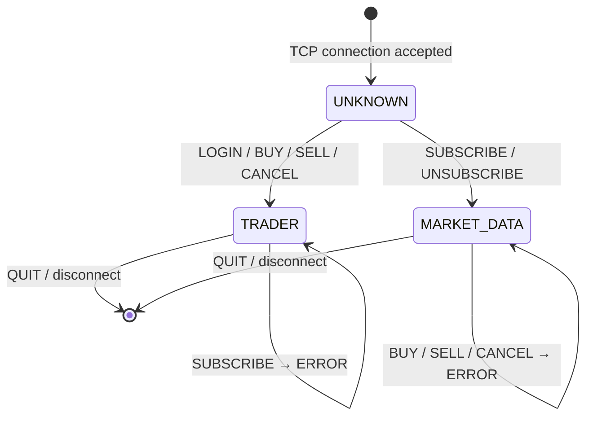
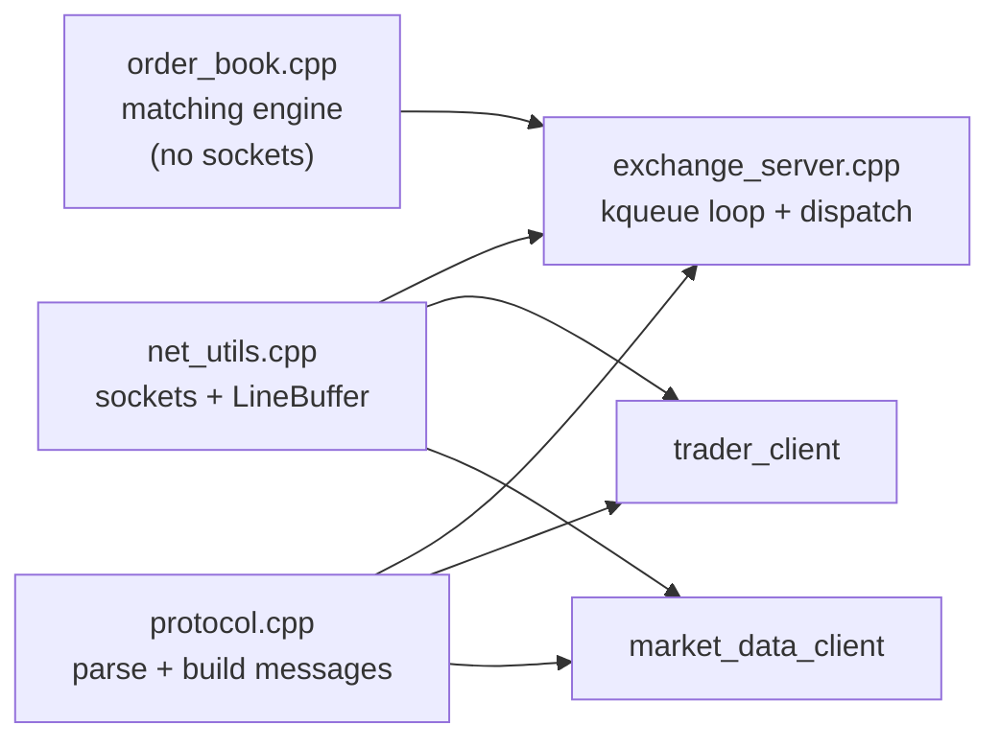

# A2 — The Socket Exchange (C++)

A TCP-based simulated trading system: one **Exchange Server**, many **Trader**
and **Market-Data** clients, all over raw POSIX sockets.
Built and tested on **FreeBSD 14.4-RELEASE**.


---

## Contents

| Section | What's in it |
|---|---|
| [Quick start](#quick-start) | build and run in four commands |
| [Architecture](#architecture) | processes, sockets, who talks to whom |
| [A worked trade](#a-worked-trade) | the exact messages of one trade |
| [Protocol reference](#protocol-reference) | every command and reply |
| [How the server works](#how-the-server-works) | event loop, roles, order book |
| [Design decisions](#design-decisions-and-assumptions) | the choices behind the code |
| [Layout](#layout) | where each file lives |
| [Bonus: 70,000 connections](#bonus--70000-idle-connections) | tuning and measurement |

---

## Quick start

```sh
make                                   # 1. build (required first)
./server/run-server      127.0.0.1 5000              # 2. terminal A
./client/run-trader      127.0.0.1 5000 alice        # 3. terminal B
./client/run-market-data 127.0.0.1 5000 JNST         # 4. terminal C
```

Then type `BUY JNST 100 238` in alice's terminal.

**`make` must run first.** No binaries are shipped; the launchers `exec` the
programs in `bin/`, which the build creates. The launchers resolve `bin/`
relative to their own path, so they work from any directory.

| | |
|---|---|
| Language | C++17 |
| Compiler | `c++` (clang++, in the FreeBSD base system — nothing to install). `g++` also works. |
| Build tool | FreeBSD's BSD `make`, or GNU `gmake`. `make clean` removes `bin/`. |
| Libraries | POSIX socket API + `kqueue` only — no Boost.Asio / libevent / asyncio (handout 4.1.2) |
| Python | only to run the provided `experiment.py` |

---

## Architecture

Every component is a separate process inside one FreeBSD VM, talking over
loopback TCP. Clients never talk to each other — only to the server.



The two directions are genuinely different:

- **Traders** are request/response *plus* asynchronous push — a `BOUGHT` can
  arrive long after the `BUY` that caused it, when someone else's order matches.
- **Market-Data** clients are one-to-many push — after subscribing they send
  nothing further, yet receive every `TRADE` for their instruments.

---

## A worked trade

alice bids for 100, bob sells 60 into it. 60 trade; 40 of alice's order rests.



Then `CANCEL 0` in alice's terminal withdraws the remaining 40, and `QUIT`
(or Ctrl-D) disconnects.

`BOUGHT`/`SOLD` are **private** execution reports for the two traders involved.
`TRADE` is the **public** one and says only what happened — never who traded.

---

## Protocol reference

One message per line, terminated by `\n`. All values are decimal integers.

**What each client may send** (handout 2.8):

| Command | Trader | Market-Data |
|---|:--:|:--:|
| `LOGIN <username>` | ✅ | — |
| `BUY <instr> <qty> <price>` | ✅ | — |
| `SELL <instr> <qty> <price>` | ✅ | — |
| `CANCEL <order_id>` | ✅ | — |
| `SUBSCRIBE <instr>` | — | ✅ |
| `UNSUBSCRIBE <instr>` | — | ✅ |
| `QUIT` | ✅ | ✅ |

**What the server sends back:**

| Reply | Meaning | Goes to |
|---|---|---|
| `OK` | `LOGIN` / `SUBSCRIBE` / `UNSUBSCRIBE` succeeded | both |
| `ERROR <reason>` | request rejected | both |
| `ORDER_ACCEPTED <id>` | order received and given an id — *not* executed | trader |
| `ORDER_CANCELLED <id>` | `CANCEL` succeeded (note: not `OK`) | trader |
| `BOUGHT <instr> <qty> <price>` | your buy executed | trader |
| `SOLD <instr> <qty> <price>` | your sell executed | trader |
| `TRADE <instr> <qty> <price>` | a trade happened in the market | market-data |

**Values** — instruments are `JNST` and `IMCT`:

| Field | Range | Out of range |
|---|---|---|
| quantity, price | `1 .. 2147483647` | `ERROR`; order neither accepted nor executed |
| order id | `0 .. 2147483647` | `ERROR` |

---

## How the server works

### Single-threaded `kqueue` event loop

One thread watches every socket and only ever touches one the kernel reports
ready, so an idle client can never block another, and a connection costs no
thread.

```mermaid
flowchart TD
    START(["start"]) --> LISTEN["make_listen_socket<br/>socket → bind → listen"]
    LISTEN --> REG["register listen fd with kqueue"]
    REG --> WAIT{{"kevent&#40;&#41; — block until a socket is ready"}}
    WAIT --> WHICH{"which fd?"}
    WHICH -->|listening socket| ACC["accept all pending<br/>set non-blocking<br/>new session"]
    WHICH -->|readable| READ["recv → LineBuffer<br/>handle each complete line"]
    WHICH -->|writable| WRITE["drain outbuf<br/>disarm when empty"]
    READ -->|"recv = 0 (FIN) or ECONNRESET (RST)"| CLOSE["close session"]
    ACC --> WAIT
    READ --> WAIT
    WRITE --> WAIT
    CLOSE --> WAIT
```



**Framing.** TCP is a byte stream, so one `recv()` may return half a message or
two and a half. Each connection has a `LineBuffer` that accumulates bytes and
yields only complete `\n`-terminated lines.

**Backpressure.** If `send()` can't take everything (a slow reader's window has
closed), the remainder is queued per-connection and `EVFILT_WRITE` is armed.
The backlog stays on that one socket; other clients keep flowing.

### Role inference

There is no handshake — the first role-specific command decides what a
connection is, and it keeps that role for life. `QUIT` is deliberately neutral,
since both roles may send it.



The role is fixed by the first role-specific command **even if that command is
then rejected** — a malformed `LOGIN` still makes the connection a Trader.

### Matching

Two orders match only if they are the **same instrument**, **opposite sides**,
and at **exactly the same price** — there is no "better price" crossing. The
traded quantity is the smaller of the two remaining quantities; any remainder
rests and may match later. Resting orders at a price are consumed oldest-first.

Each match is its own trade: a `SELL 40` meeting two resting `BUY 20`s produces
**two** `TRADE` messages and **two** `BOUGHT`/`SOLD` pairs, never one merged
message.

---

## Design decisions and assumptions

| Decision | Behaviour |
|---|---|
| **Concurrency / I/O** | Single-threaded `kqueue` event loop. Rationale in `report.pdf` §1. |
| **Orders outlive their connection** | A disconnect does **not** cancel resting orders (handout 2.6). They can still match; the departed trader gets no `BOUGHT`/`SOLD`, but market-data clients still get the `TRADE`. |
| **Order ownership** | An order is owned by a *connection*, identified by `(fd, session_seq)` with a never-reused sequence number — the kernel recycles fds, so fd alone would let a later client inherit a dead connection's orders. |
| **Reconnecting** | A new connection using a freed username is a brand-new client. It inherits no orders and cannot cancel the previous connection's orders. |
| **Usernames** | Unique among *currently connected* traders; freed for reuse on disconnect. |
| **`LOGIN` not required** | `BUY`/`SELL`/`CANCEL` work without a prior `LOGIN` — the handout states no such precondition. |
| **Self-trades** | A trader's own orders may match each other; that client receives both `BOUGHT` and `SOLD`. |
| **`UNSUBSCRIBE`** | Idempotent — unsubscribing something not subscribed still answers `OK`. |
| **`QUIT`** | No reply; the server simply closes the connection. Handout 2.3 lists `OK` for `LOGIN`/`SUBSCRIBE`/`UNSUBSCRIBE` only. |
| **Server binding** | Host and port come from the command line; loopback is fine. No other configuration. |

---

## Layout

```
server/run-server           launcher → exec bin/exchange_server
client/run-trader           launcher → exec bin/trader_client
client/run-market-data      launcher → exec bin/market_data_client

src/common/                 protocol parsing, socket helpers, line framing
src/server/                 event loop, order book, per-connection session
src/trader/                 trader client
src/market_data/            market-data client
bonus/                      70k connection generator + measurement scripts

Makefile                    builds everything into bin/
report.pdf                  experiment answers + implementation decisions
```



`order_book` deliberately knows nothing about sockets — it takes orders in and
returns fills, which keeps matching unit-testable without any networking.

**Experiments:** copy the provided `experiment.py` next to `server/`, run
`make`, then `python3 experiment.py <n>`.

---

## Bonus — 70,000 idle connections

`bonus/conn_generator.cpp` (built as `bin/conn_generator`) opens and holds N
idle TCP connections:

```sh
./bin/conn_generator 127.0.0.1 5000 70000 127.0.0.1,127.0.0.2,127.0.0.3
```

Helpers: `sh bonus/bonus_run.sh <count>` runs one measurement level end to end;
`sh bonus/bonus_measure.sh 5000` measures an already-running server.

Reaching 70,000 needs kernel tuning first — **as root, runtime-only, re-apply
after reboot.** Full rationale in `report.pdf` §3.

```sh
sysctl kern.ipc.maxsockets=400000       # default 129967; sizes the socket zone — the real limit
sysctl kern.maxfiles=400000             # default 129967
sysctl kern.maxfilesperproc=200000      # default 116964
sysctl kern.ipc.somaxconn=4096          # default 128 (precaution; listen backlog is 128)
sysctl net.inet.ip.portrange.first=1024 # default 10000

ifconfig lo0 alias 127.0.0.2/32         # extra source IPs: 70k needs >65k tuples
ifconfig lo0 alias 127.0.0.3/32
```

A single `(src ip, src port)` pair tops out below 65,536 tuples against one
server socket, which is why the extra loopback aliases are required.
